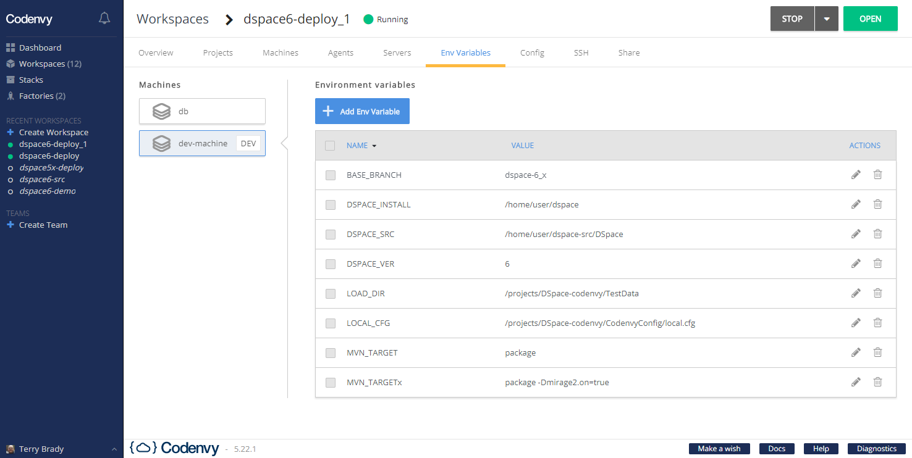

# Overview
The following overview presentation was given to the DSpace Developer Show and Tell Meeting

Once you have a Codenvy account, the following [workspace factory](https://codenvy.io/dashboard/#/load-factory?id=factoryrptn7ed0wdg67je7) can be used as a quick start environment.

## Codenvy Workspace Environment Variables
- DSPACE_SRC
  - /projects/DSpace
  - /projects/DSpace-rel-demo
  - /home/user/dspace_src/DSpace
- BASE_BRANCH    (dspace-5_x|dspace-6_x|master)
- DSPACE_INSTALL /home/user/dspace
- LOAD_DIR       /projects/DSpace-Codenvy/TestData
- LOCAL_CFG      (/projects/DSpace-Codenvy/local.cfg|/projects/DSpace-Codenvy/build.properties)
- MVN_TARGET     (package|package -Dmirage2.on=true)
- DSPACE_VER     (5|6|7)

## Deployment Options

- Use Codenvy as a deployment environment for DSpace (requires 3GB RAM)
  - DSPACE_SRC=/home/user/dspace_src/DSpace
- Use Codenvy as an IDE/deployment environment for DSpace "release" code (requires 3GB RAM)
  - DSPACE_SRC=/projects/DSpace-rel-demo
- Use Codenvy as an IDE/deployment environment for full DSpace "src" code (requires 5-6GB RAM)
  - DSPACE_SRC=/projects/DSpace

### Related Repositories

- [DSpace Docker Images](https://github.com/DSpace-Labs/DSpace-Docker-Images)
- [DSpace "Release" Code - Demo 6.2 Repo](https://github.com/DSpace-Labs/DSpace-rel-demo)

### Notes

- It is possible to give Codenvy access to your GitHub credentials.  I recommend using a secondary GitHub account with limited access rights.
- This deployment scripts apply the following changes
  - Since this is a test environment, the solr service deployed with the localhost restriction removed
  - The legacy rest api is overridden to be accessible by http
- OAI Service
  - The following settings (appropriate to runtime container) must be set to test the OAI Service
    - `dspace.hostname = node12.codenvy.io:51943`
    - `dspace.baseUrl = http://node12.codenvy.io:51943`
  - Note, the ORE component of the OAI service does not seem to work.
